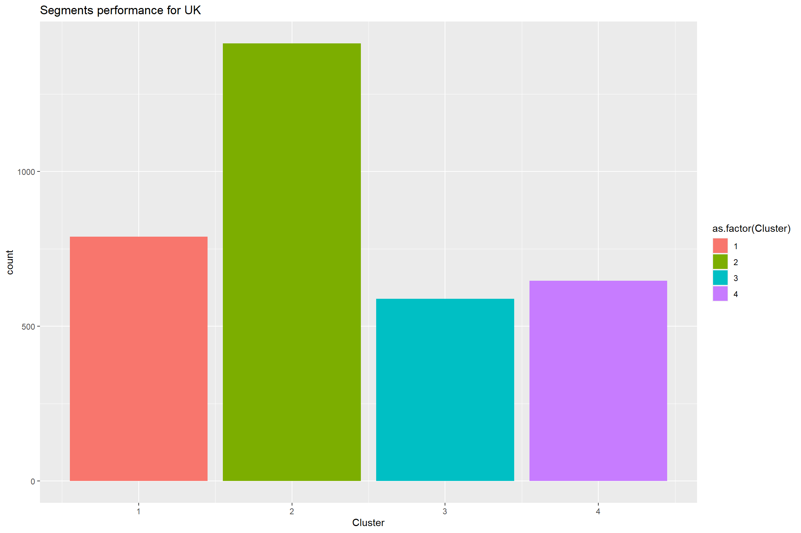

# RFM Customer segmentation with K Means

This article is part of a bigger project for development of basic marketing analytics stack. The idea is to build a stack of reusable and replicable templates for ML based marketing analysis. Template here is used in the sense of process logic, reusable code snippets and generalised business case scenarios for which the model is applicable.

For every analytical model an interactive application in Shiny is suggested. The idea of the app is to serve as a reusable framework for model presentation. This will allow for non-technical users to get visual understanding of the data and play with different scenarios directly on the app. In addition, the application will allow for automation of the analysis. This means that when the application is integrated with the data source, every change in the data will automatically change the output figures from the analysis. This will allow for instantaneous marketing action like grasping time sensitive opportunities for up-sale promotions.

### Structure of the article:

1.	Business objectives of the model;
2.	Algorithm behind the model;
3.	Model development process;
4.	Ideas for further analysis of the model output.

### Business objectives of customer segmentation

**Customer segmentation** helps you understand how, why, and when your product or service is purchased/used. These insights are crucial for efficient allocation of marketing resources.

**Recency, frequency and monetary (RFM)** customer segmentation gives you a base model to analyse customers according to their transactional behaviour – how recent was their last transaction, how often they purchase and how much are they spending.

**RFM customer segmentation** therefore is an effective way to prevent customer churn, identify and use up-sale and cross-sale opportunities.

### Why K Means clustering

**K means** is unsupervised algorithm and probably the most used algorithm for clustering. One of the major advantages of K means is that it can handle larger data sets compared to for example the hierarchical cluster approaches. 

However, K-means comes with some disadvantages as well. It is sensitivity to outliers. The data sets used with K means need scaling before performing the algorithm.

### Why R

The advantages in using R:

-	Availability of well developed analytical packages;
-	Ease of creating beautiful layered visualisations;
-	Ease of presenting ML models through interactive applications (Shiny App)

### Model development process

The development process of the model has 2 main stages:

**Data Preparation**

1.	Data Preparation:
2.	Feature engineering 
3.	Summary statistics of the engineered data sets
- remove outliers;
- scale the data
4.	Build a heatmap to define the correlations between the variables.

**Model Development**

6.	K means model development
-	Define data point distance measurement method;
-	Define optimal number of clusters;
-	Build the clusters
- Visualise the clusters

7.	Ideas for cluster analysis and persona building
-	Categorise the clusters according to their value for the business;
-	Provide geospatial visualisation of the most dominant clusters per country 


## Data preparation

The main objective of this stage is to remove missing values, convert data types where necessary and examine the data for any disrepancies


Check basic statistics of the cleaned data set


The time span of the data set is about a year: 

* maxDate =  2011-12-09
* minDate =  2010-12-01

In real business scenario the time span needed for customer segmentation should be defined by the business objective, the maturity of the business,the dynamics of the market, the type of product or service sold.
Also in cases where there is seasonality in the purchase behaviour, the time span for customer segmentation should capture at least 2 similar seasons. Usually this means that the analysis will be done over 24 months of transactional data.

The summary of the data shows that there are transactions with a total product price of 0 and products with negative quantities. This means that we might be dealing with refunds and discounts.We will remove the refunds and  discounts together with their original transactions. These can be analysed later on segment level. For example which of the segments claimed the most refunds. This type of analysis can turn out to be quite important not only for the development of the product and services, but also for the further profiling of the segments


## Features engineering 

To build the RFM model first we need to calculate the values for the recency, frequency and monetary variables. We can use the below equations.

**recency** = the most recent date of the data set minus the maximum date per customer purchase purchase. The lower is the value the more recent was the customer visit to the store
**frequency** = number of distinct purchases
**monetary** = the sum of the total spent per customer

These variables together with the customer id will form the data frame for our clusters


As we mentioned earlier K Means is calculated based on the distances between the data points. This makes it sensitive to the presence of outliers. Running a summary statistics of the data set will help us define whether there are any outliers values. 


The summary statistics shows that we have outliers in the frequency and monetary variables. For the purpose of getting the clustering right we need to remove these outliers. However, we should not forget about them as they represent our most valuable customers. 

To remove the outliers we need to identify a numerical cut-off range that differentiates an outlier from a non-outlier. We will use the [1.5*iqr rule](https://www.khanacademy.org/math/statistics-probability/summarizing-quantitative-data/box-whisker-plots/a/identifying-outliers-iqr-rule) for that purpose.

We can calculate the interquartile range by finding first the quantiles. Here we use the quantile() function to find the 25th and the 75th percentile of the dataset and the IQR() function, which gives the difference between the 75th and 25th percentiles.


Then we calculate the upper and lower range limits of our data:

**upper** <-  Q3+1.5*iqr
**lower** <- Q1-1.5*iqr 

We can use the subset() function to apply the 1.5*iqr rule and remove the outliers from the data set


Now we can check whether our values range looks more evenly spread. Visualise the range by using a boxplot visualisation


### Scaling (normalising) the data 

The next step is to normalise the variables to have mean = 0 and variance = 1. For this we will use the R scale() function. This step is important as we want the K Means algorithm to weight equally the variables when creating the clusters.


Now we can visualise the correlation between the variables. We can use a heatmap for that purpose.


We have only 3 variables and just 2 of them are slightly correlated. The lack of strong correlation is a good sign as it will prevent any bias in the model development.The interesting observation here is the negative correlation b/w recency and frequency. This is because of the opposite ways in which we assess the two variables. The lower is the recency value, the better ranked is the customer and the opposite applies for frequency - the higher, the better. Another observation is that the more frequent transactions have higher value, which kind of make sense.


Overall the more recent transactions have higher frequency. This might be an indicator of seasonality in the busines performance. As our cut off date is in December (Christmas period) the closer to Christmas we get, the more frequent the orders per customer become. This means that in order to be accurate in our segmentation we will need data from at least 2 years, e.g. 2 shopping seasons. Unfortunately, The available data set is only from one year. We will use it as it just to showcase the way the algorithm works.


## Building the K means model

### Choose a method to measure the distances between the data points

The main objective of K-means is to group the data into uniform sets of similar observations that are distinguishable from other sets of similar observations. The similarity and dissimilarity between the observations is defined by computing the distances between the data points. There are [different ways](https://machinelearningmastery.com/distance-measures-for-machine-learning/) of measuring the distances between data points.The Euclidean method is the only method that [works](https://stats.stackexchange.com/questions/81481/why-does-k-means-clustering-algorithm-use-only-euclidean-distance-metric) with K-means. 


### Define the number of clusters

The next step is to specify the optimal number of clusters we can split the data on. First we can try to find the number of clusters manually just to get a feeling of how the K Means work.Then we can automate this process by using an algorithm.
For the manual calculation we can  use kmeans() function. Let`s calculate and visualise our options with clusters from 2 to 8. The "centres" part of the function defines the number of clusters while the "nstart" defines the number of times sthe data will be reshuffled to find the most cohesive cluster given the set up. Here we will set the nstar = 25. This means that R will run with 25 random assignments and will select the one with the lowest within cluster variation. 


There are different automated ways to define the optimal number of cluster. We will compare the output of 2 methods - the Elbow and the Average Silhouette Method. For both of them use the fviz_nbclust() function.

**Elbow method** - the basic idea of this method is that the total inter cluster variation,e.g. the total within cluster sum of squares is minimised. 


**Average Silhouette Method** - measures the quality of the clustering, how well each object lies within its cluster


Both of the methods suggested that the best number of clusters is four. Let`s apply this result in a final K-means calculation. Use the set.seed() function to get reproducible result. Remember from above that the K means uses random reshuffling of the observations to get the optimal cluster split.


We have got 4 clusters with pretty much similar sizes apart from one, which is about double the size of the rest of the clusters. 

In the remaining part of this article we will explore some ideas for further analysis of the segments.


## Segment Analysis

As a beginning we can get some basic figures describing the size of the segments and the way they score within the RFM model.

The size we can define by the number of observations assigned to each cluster. While the mean value of each feature (recency, frequency and monetary) will give us an idea of which are our best and worst performing segments.

We can get these figures by running a summary table of the clustered data using summarise_all() function. This function works only with numeric data. Therefore before running it we will need to exclude the customer id column as it is character format. After qwe get ;our summary table we will transpose it  to facilitate its visualisation.


Now we can visualise the segments to determine which are the most and the least valuable ones. this will give us an idea of how and where to focua our marketing efforts.


From the visualisation of the summary statistics we can conclude that our most valuable customers are in segment 1 and 2. Segment 3 can be defined as lapsed as it has less than 2 purchases made almost a year ago. Our most active segment is segment 2. On the other hand segment 1 has the highest propensity to spend. Therefore, if we put some marketing efforts in increasing the frequency of purchase of segment 1, we can yield  significant revenue for the company. 

Segment 4 is our biggest segment. The only feature that makes it better than the lapsed segment 3 is the  recency of purchase. Otherwise the customers from this segment made on average no more than 2 purchases. As this is the biggest segment it worth putting effort to increase its frequency of purchase by testing promotions and cross-sale campaigns.

### Geographic Profiling of the segments

Another interesting analysis of the segments is their geographic distribution. To perform this analysis we need to attach the segments to the initial data frame and get the geographic attributes of the customers. Also do not forget to deduplicate your data set and leave only unique customer records.


Now you can run some bar charts visualisations of the segments performance per country.


We can see that the number of customers for UK is disproportionally higher compared to the rest of the countries. Therefore we will separate the analysis of the UK from the rest of the countries.

Let`s see how the segments are represented in UK and the rest of the rest of the world separately.




Our best segments 1 and 2 are well represented in Germany and France.The business has good base to develop its market share within these 2 geographies

Segment 2 has dominant representation in the UK market. This was our most active segment. 

For both of the markets - UK and the world hand segment 1 - the segment with the highest propensity to spend is smaller in size compared to segment 2. It will make sense if we focus our marketing efforts on increasing the representation and activity of segment 1.

Finally we can get geospatial representation of the dominant segments per country.

Finally we can get geospatial representation of the dominant segments per country.


```
## Error in st_sf(x, ..., agr = agr, sf_column_name = sf_column_name): no simple features geometry column present
```
